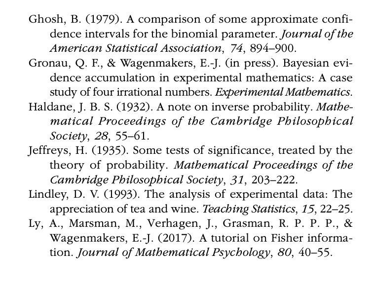

This is a annotated implementation of the paper *"Introduction to the Concept of Likelihood and Its Applications"* by [@etz2018introduction]. It does not go though the entire paper but it does consider the most essential points. It is inspired the the Annotated Transformer by [@rush2018annotated]. This article will mainly contains snippets from the original as well as annotation which will be marked using a <mark>highlight</mark>. It will also contain an extended application at the end.

---

## Abstract
This Tutorial explains the statistical concept known as likelihood and discusses how it underlies common frequentist and Bayesian statistical methods. The article is suitable for researchers interested in understanding the basis of their statistical tools and is also intended as a resource for teachers to use in their classrooms to introduce the topic to students at a conceptual level.


## Introductions
Likelihood is a concept that underlies most common statistical methods used in psychology. It is the basis of classical methods of maximum likelihood estimation, and it plays a key role in Bayesian inference. However, despite the ubiquity of likelihood in modern statistical methods, few basic introductions to this concept are available to the practicing psychological researcher. The goal of this Tutorial is to explain the concept of likelihood and illustrate in an accessible way how it enables some of the most used kinds of classical and Bayesian statistical analyses; given this goal, I skip over many finer details, but interested readers can consult Pawitan (2001) for a complete mathematical treatment of the topic (see Edwards, 1974, for a historical review). This Tutorial is aimed at applied researchers interested in understanding the basis of their statistical tools and can also serve as a resource for introducing the topic of likelihood to students at a conceptual level.
Likelihood is a strange concept in that it is not a probability but is proportional to a probability. The likelihood of a hypothesis ($H$) given some data ($D$) is the probability of obtaining $D$ given that $H$ is true multiplied by an arbitrary positive constant $K$: $L(H) = K × P(D|H)$. 

In most cases, a hypothesis represents a value of a parameter in a statistical model, such as the mean of a normal distribution. Because a likelihood is not actually a probability, it does not obey various rules of probability; for example, likelihoods need not sum to 1.

A critical difference between probability and likelihood is in the interpretation of what is fixed and what can vary. In the case of a conditional probability, $P(D|H)$, the hypothesis is fixed and the data are free to vary. Likelihood, however, is the opposite. The likelihood of a hypothesis, $L(H)$, is conditioned on the data, as if they are fixed while the hypothesis can vary. The distinction is subtle, so it is worth repeating: For conditional probability, the hypothesis is treated as a given, and the data are free to vary. For likelihood, the data are treated as a given, and the hypothesis varies.

## The likelihood Axiom
Edwards (1992) synthesized two statistical concepts — the law of likelihood and the likelihood principle — to define a likelihood axiom that can form the basis for interpreting statistical evidence. The law of likelihood states that *“within the framework of a statistical model, a particular set of data supports one statistical hypothesis better than another if the likelihood of the first hypothesis, [given] the data, exceeds the likelihood of the second hypothesis”* (Edwards, 1992, p. 30). In other words, there is evidence for $H_1$ over $H_2$ if and only if the probability of the data under $H_1$ is greater than the probability of the data under $H_2$. That is, D is evidence for $H_1$ over $H_2$ if $P(D|H_1) > P(D|H_2)$. If these two probabilities are equivalent, then there is no evidence for either hypothesis over the other. Furthermore, the strength of the statistical evidence for $H_1$ over $H_2$ is quantified by the ratio of their likelihoods, which is written as $LR(H_1, H_2) = L(H_1)/L(H_2)$ — which is equal to $P(D|H_1)/P(D|H_2)$ because the arbitrary constants cancel out of the fraction.

The following brief example illustrates the main idea underlying the law of likelihood. Consider the case of Earl, who is visiting a foreign country that has a mix of women-only and mixed-gender saunas (the latter known to be visited equally often by men and women). After a leisurely jog through the city, he decides to stop by a nearby sauna to try to relax. Unfortunately, Earl does not know the local language, so he cannot deter- mine from the posted signs whether this sauna is for women only or both genders. While Earl is attempting to decipher the signs, he observes three women inde- pendently exit the sauna. If the sauna is for women only, the probability that all three exiting patrons would be women is 1.0; if the sauna is for both genders, this probability is .125 (i.e., .53). With this information, Earl can compute the likelihood ratio between the women - only hypothesis and the mixed-gender hypothesis to be 8 (i.e., 1.0/.125); in other words, the evidence is 8 to 1 in favor of the sauna being for women only.
The likelihood principle states that the likelihood function contains all of the information relevant to the evaluation of statistical evidence. Other facets of the data that do not factor into the likelihood function (e.g., the cost of collecting each observation or the stopping rule used when collecting the data) are irrelevant to the evaluation of the strength of the statistical evidence (Edwards, 1992, p. 30; Royall, 1997, p. 22). They can be meaningful for planning studies or for decision analysis, but they are separate from the strength of the statistical evidence.
Edwards (1992) defined the likelihood axiom as a natural combination of the law of likelihood and the likelihood principle. The likelihood axiom takes the implications of the law of likelihood together with the likelihood principle and states that the likelihood ratio comparing two statistical hypotheses contains *“all the information which the data provide concerning the relative merits”* of those hypotheses (p. 30).

## Likelihoods Are Meant to Be Compared
Unlike a probability, a likelihood has no real meaning per se, because of the arbitrary constant K. Only through comparison do likelihoods become interpretable, because the constants cancel one another out. An example using the binomial distribution provides a simple way to explain this aspect of likelihood.
Suppose a coin is flipped $n$ times, and we observe $x$ heads and $n – x$ tails. The probability of getting $x$ heads in n flips is defined by the binomial distribution as follows:


$$
P(X=x|p) =\binom nk \cdot  p \cdot (1−p)
\tag{1}
$$
where p is the probability of heads and the binomial coefficient,

$$
\binom nk = \frac{n!}{x!(n-x)!}
$$
counts the number of ways to get x heads in n flips. 

<mark>For the reader unfamiliar the binomial distribution, I suggest watching this wonderful video right here before moving on: </mark>

<iframe width="560" height="315" src="https://www.youtube.com/embed/8idr1WZ1A7Q" frameborder="0" allow="accelerometer; autoplay; clipboard-write; encrypted-media; gyroscope; picture-in-picture" allowfullscreen></iframe>

For example, if $x = 2$ and $n = 3$, the binomial coefficient is calculated as $3!/(2! × 1!)$, which is equal to 3; there are three distinct ways to get two heads in three flips (i.e., head-head-tail, head-tail-head, tail-head-head). Thus, the probability of getting two heads in three flips if p is $.50$ would be $.375( 3 ×.50^2 × (1–.50)^1)$, or 3 out of 8. If the coin is fair, so that $p = .50$, and we flip it 10 times, the probability of six heads and four tails is

$$
P(X =6|p=.50)= \frac{10!}{6! × 4!} (.50)^6(1−.50)^4 ≈.21
$$
If the coin is a trick coin, so that $p = .75$, the probability of six heads in 10 tosses is

$$
P(X =6|p=.75)= \frac{10!}{6! × 4!} (.75)^6(1−.75)^4 ≈.15. 
$$

To quantify the statistical evidence for the first hypothesis against the second, we simply divide one probability by the other. This ratio tells us everything we need to know about the support the data lend to the fair-coin hypothesis vis-à-vis the trick-coin hypothesis. In the case of six heads in 10 tosses, the likelihood ratio for a fair coin versus the trick coin, denoted $LR(.50,.75)$, is
$$
LR(.50,.75) = \left( \frac{10!}{6! × 4!} (.50)^6 (1 − .50)^4 \right) ÷  \left( \frac{10!}{6! × 4!} (.75)^6 (1 − .75)^4 \right) ≈ .21/.15 = 1.4
$$
In other words, the data are $1.4$ times more probable under the fair-coin hypothesis than under the trick-coin hypothesis. Notice how the first terms in the two equations, $10!/(6! × 4!)$, are equivalent and completely cancel each other out in the likelihood ratio.

The first term in these equations reflects the rule we used for ending data collection. If we changed our sampling plan, the term’s value would change, but crucially, because it is the same term in the numerator and denominator of the likelihood ratio, it always cancels itself out. For example, if we were to change our sampling scheme from flipping the coin 10 times and counting the number of heads to flipping the coin until we get six heads and counting the number of flips, this first term would change to $9!/(5! × 4!)$ because the final trial would be predetermined to be a head (Lindley, 1993). But, crucially, because this term is in both the numerator and the denominator, the information contained in the way the data were obtained would disappear from the likelihood ratio. Thus, because the sampling plan does not affect the likelihood ratio, the likelihood axiom tells us that the sampling plan can be considered irrelevant to the evaluation of statistical evidence, which makes likelihood and Bayesian methods particularly flexible (Gronau & Wagenmakers, in press; Rouder, 2014).
Consider if we leave out the first term in our calculations after observing six heads in 10 coin tosses, so that our numerator is $P(X = 6|p = .50) = (.50)^6(1 – .50)^4 = 0.000976$ and our denominator is $P(X = 6|p = .75) = (.75)^6(1 – .75)^4 = 0.000695$. Using these values to form the likelihood ratio, we get $LR(.50,.75) = 0.000976/ 0.000695 = 1.4$, confirming our initial result because the other terms simply canceled out before. Again, it is worth repeating that the value of a single likelihood is meaningless in isolation; only in comparing likelihoods do we find meaning.

## Inference using the likelihood function

### Visual inspection
So far, likelihoods may seem overly restrictive because we have compared only two simple statistical hypotheses in a single likelihood ratio. But what if we are interested in comparing all possible hypotheses at once? By plotting the entire likelihood function, we can *“see”* the full evidence the data provide for all possible hypotheses simultaneously. Birnbaum (1962) remarked that *“the ‘evidential meaning’ of experimental results is characterized fully by the likelihood function”* (p. 269), so let us look at some examples of likelihood functions and see what insights we can glean from them.

<mark>In the original paper the figure is supplied but for illustrative purposes let us take a moment to consider how to plot this ourselves. This will be done in R. Furthermore coin-flip examples can be quite arbitrary so let's (like in the video) consider number of positive and negative reviews and try to estimate the true probability of a positive review. This should naturally reflect the underlying quality of the product you want to buy</mark>

```{r, warnings=F, message=F, results = "hide", fig.show="hide"}
library(tidyverse)

# our observed data
n_positive = 13
n_negative = 7
number_of_reviews = n_negative + n_positive

p = seq(0, 1, by = 0.01)  # create a grid for the x-axis in step of 0.01 (this is our proposed values of p)
likelihood = dbinom(n_positive, size=number_of_reviews, prob=p)

data = tibble(p, likelihood)
plot = ggplot(data, aes(p, likelihood)) + 
  geom_line()
plot # display plot
```

```{r, echo=F, fig.cap="Fig. 1: A plot showing the likelihood over p. Note that a few extra thing have been added to the plot beyond the code."}
maximum_likelihood = p[likelihood == max(likelihood)]

plot + 
  theme_minimal() +
  geom_vline(xintercept=maximum_likelihood, linetype="dashed", alpha=0.5) + 
  annotate("point", x = maximum_likelihood, y=max(likelihood)) + 
  theme_minimal() +
  labs(x="Probability", y="Likelihood")
```

<mark>
The reader is now encourages to
- 1) explain the `dbinom` function
- 2) change the number of positive and negative to see how it changes the results
  - 2.1) What happens if you multiply the number of negative and positives by 2?
  - 2.2) What happens if you only see 2 positive review?

The top panel of Figure 1 shows the likelihood function for observing 13 positive reviews out of 20 total review.heads in 10 flips. </mark> The likelihood ratio of any two hypotheses is simply the ratio of their heights on this curve.

We need to be careful not to make blanket statements about absolute support, such as claiming that the hypothesis with the greatest likelihood is *“strongly supported by the data.”* Always ask what the comparison is with. The best-supported hypothesis will usually be only weakly supported against any hypothesis positing a value that is a little smaller or a little larger .3 For example, in the case of <mark>60 positive reviews out of total reviews</mark>, the likelihood ratio comparing the hypotheses that $p = .60$ and $p = .75$ is very large, $LR(.60,.75) = 224$, whereas the likelihood ratio comparing the hypotheses that $p = .60$ and $p = .65$ is much smaller, $LR(.60,.65) = 1.7$, and provides barely any support one way or the other. Consider the following common real-world research scenario: We have run a study with a relatively small sample size, and the estimate of the effect of primary scientific interest is considered *“large”* by some criteria (e.g., Cohen’s $d > 0.75$). We may find that the estimated effect size from the sample has a relatively large likelihood ratio compared with a hypothetical null value (i.e., a ratio large enough to “reject the null hypothesis”; see the next section), but that the likelihood ratio is much smaller when the comparison is with a *“medium”* or even *“small”* effect size. Without relatively large sample sizes, one is often precluded from saying anything precise about the size of the effect because the likelihood function is not very peaked when samples are small.


## Maximum likelihood estimation
A natural question for a researcher to ask is, what is the hypothesis that is most supported by the data? This question is answered by using a method called maxi- mum likelihood estimation (Fisher, 1922; see also Ly, Marsman, Verhagen, Grasman, & Wagenmakers, 2017, and Myung, 2003). In the plots in Figure 1, the vertical dotted lines mark the value of $p$ that has the highest likelihood; this value is known as the *maximum likelihood estimate*. We interpret this value of $p$ as being the value that makes the observed data the most probable. Because the likelihood is proportional to the probability of the data given the hypothesis, the hypothesis that maximizes $P(D|H)$ will also maximize $L(H)$. In the case of simple problems, plotting the likelihood function will reveal an obvious maximum. For example, the maximum of the binomial likelihood function will be located at the proportion of successes observed in the sample. Box 1 <mark>(located in the appendix)</mark> shows this to be true using a little bit of elementary calculus.

With the maximum likelihood estimate in hand, there are a few possible ways to proceed with classical inference. First, one can perform a likelihood ratio test comparing two versions of the proposed statistical model: one in which the parameter of interest, $\theta$, is set to a hypothesized null value and one in which the parameter is estimated from the data (the null model is said to be nested within the second model because it is a special case of the second model in which the parameter equals the null value). In practice, this amounts to comparing the value of the likelihood at the maximum likelihood estimate, $\theta_{mle}$, and the value of the likelihood at the proposed null value, $\theta_{null}$. Likelihood ratio tests are commonly used to draw inferences with structural equation models. In the case of the binomial coin-toss example from earlier in this Tutorial, we would compare the probability of the data if p were .50 (the fair-coin hypothesis) with the probability of the data given the value of p estimated from the data (the maximum likelihood estimate). In general, it can be shown that when the null hypothesis is true, and as the sample size gets large, twice the logarithm of this likelihood ratio approximately follows a chi-squared distribution with a single degree of freedom (Casella & Berger, 2002, p. 489; Wilks, 1938):

$$
2log \left( \frac{P(X|\theta_{mle})}{P(X|\theta_{null})} \right) \dot\sim  \chi^2(1)
\tag{2}
$$

where $\dot\sim$ means *“is approximately distributed as.”* If the value of the quantity on the left-hand side of Equation 2 is large enough (i.e., lies far enough out in the right tail of the chi-squared distribution), such that the p value is lower than a prespecified cutoff α (often chosen to be .05), then one would make the decision to reject the hypothesized null value.

<mark>
Let is just pause the article here and see how this would be implemented in code. First we will need to calculate the maximum likelihood estimate $P(X|\theta_{mle})$ and the likelihood of the null $P(X|\theta_{null})$:
</mark>


```{r}
h0 <- likelihood[p==0.5]
ha <- likelihood[p==maximum_likelihood]

h0
ha
```

<mark>
Then we can simply calculate the likelihood ratio and calculate the p-value using the chi-squared $\chi^2$:
</mark>

```{r}
lik_ratio <- 2*log(ha/h0)

p_value = pchisq(q = lik_ratio, df = 1, lower.tail = F)
p_value
```

<mark>
We see here that in fact the we cannot reject (given a significance threshold of 0.05) that the reviews we see were indeed given by chance.

The reader is now encouraged to
- 3) assuming we have 7 negative review, test how many positive reviews would be needed to get a p-value < 0.05
- 4) how many would be need in the significance threshold was 0.001 instead?
</mark>


<mark>
Here the papers original goes into an another alternative, called Wald's test, but it only touches on it briefly and without enough information to truly understand it nor implement it. Thus it is left out. The interested reader is naturally referred to the paper itself. Instead we will look at the more relevant alternative:
</mark>


## Bayesian updating via. the likelihood
As we have seen, likelihoods form the basis for much of classical statistics via the method of maximum likelihood. estimation. Likelihoods are also a key component of Bayesian inference. The Bayesian approach to statistics is fundamentally about making use of all available information when drawing inferences in the face of uncertainty. This information may be the results from previous studies, newly collected data, or, as is usually the case, both. Bayesian inference allows one to synthesize these two forms of information to make the best possible inference.
Previous information is quantified using what is known as a prior distribution. The prior distribution of θ, the parameter of interest, is $P(\theta)$; this is a function that specifies which values of θ are more or less likely, given one’s interpretation of previous relevant information. The information gained from new data is represented by the likelihood function, proportional to $P(D|θ)$, which is then multiplied by the prior distribution (and rescaled) to yield the posterior distribution, $P(θ|D)$, which is then used as the basis for the desired inference. Thus, the likelihood function is used to update the prior distribution to a posterior distribution. Interested readers can find a detailed technical introduction to Bayesian inference in Etz and Vandekerckhove (2017) and an annotated list of useful Bayesian-statistics references in Etz, Gronau, Dablander, Edelsbrunner, and Baribault (2017).

Mathematically, a well-known conditional-probability theorem <mark>, Bayes theorem, </mark> (first shown by Bayes, 1763) states that the procedure for obtaining the posterior distribution of $\theta$ is as follows:

$$
P(θ|D) = K × P(θ) × P(D|θ)
$$
In this context, $K$ is merely a rescaling constant and is equal to $1/P(D)$. We often write this theorem more simply as

$$
P(θ | D) ∝ P(θ) × P(D | θ)
$$
where $∝$ means *“is proportional to.”*

<mark>
The reader might be more familiar with the formulation of bayes theorem as:
</mark>

$$
P(θ|D) = \frac{P(θ) × P(D|θ)}{P(D)}
$$
<mark>
but as noted by the author these formulations are equivalent.
</mark>

The following example shows how to use the likelihood function to update a prior distribution into a posterior distribution. The simplest way to illustrate how likelihoods act as an updating factor is to use conjugate distribution families (Raiffa & Schlaifer, 1961). A prior distribution and likelihood function are said to be conjugate when multiplying them together and rescaling results in a posterior distribution in the same family as the prior distribution. For example, if one has binomial data, one can use a beta prior distribution to obtain a beta posterior distribution (see Box 2, <mark>, in the appendix </mark>). Conjugate prior distributions are by no means required for doing Bayesian updating, but they reduce the mathematics involved and so are ideal for illustrative purposes. 

Consider the previous example of observing <mark> 60 positive reviews out of 100</mark>. Imagine that going into <mark>a review site we suspect that the company might have added a few positive reviews to the pile or maybe that our friend have had a bad experience with the product. This assumption could be expressed in the following way:</mark>

```{r, warnings=F, message=F, results = "hide", fig.show="hide"}
a = 4
b = 8
prior = dbeta(p, a, b)

data = tibble(p, prior)
plot = ggplot(data, aes(p, prior)) + 
  geom_line(aes(color="Prior"))
plot
```

```{r, echo=F, warnings=F, message=F, results = "hide", fig.cap="Fig. 2: A plot showing our prior belief over p. Note that a few extra thing have been added to the plot beyond the code."}

plot = plot + 
  theme_minimal() +
  geom_vline(xintercept = 0.5, linetype="dashed", alpha = 0.5) + 
  labs(x="Probability", y="probability Density") + 
  scale_color_manual(values = c("steelblue")) 
plot

plot = plot + scale_color_manual(values = c("lightsteelblue", "steelblue")) 
```

<mark>
Note that this reflects our belief that reviews are slightly more likely to be negative, but still allows for the high chance of a positive review. To construct this prior we used a beta(a, b) distribution it is a distribution of probabilities as it spans from 0 to 1. The author of the original paper never touches upon what this really means (understandably so as it is slightly tricky to explain), but I believe it is relevant for understanding I thus recommend spending the time to watch this continuation of the previous video by 3Blue1Brown:
</mark>

<iframe width="560" height="315" src="https://www.youtube.com/embed/ZA4JkHKZM50" frameborder="0" allow="accelerometer; autoplay; clipboard-write; encrypted-media; gyroscope; picture-in-picture" allowfullscreen></iframe>

<mark>
A few additional points on the beta distribution before we move on. The parameters a and b, determine its form: When a = b, the distribution is symmetric around .50; as a special case, when a = b = 1, the distribution is uniform (flat) between 0 and 1; when b > a, the distribution puts more mass on values below .50 as we have already seen, and when a < b, the distribution puts more mass on values below .50. The reader is encouraged to play around with each of this cases to get a sense of the distribution.

Exercise:
- 5) The interested reader might try out a flat prior using beta(1, 1). How does the likelihood look compared to posterior?
</mark>

<mark>
The likelihood function for the 60 positive reviews out of 100 can now the added to the previous plot and we can multiply then together to get the posterior following Bayes theorem. Note that we rescale the posterior to sum to one as it is a probability. This corresponds to the constant $K$.
</mark>

```{r, fig.cap="Fig. 2.1: A plot showing the prior and likelihood over p."}
# our observed data
n_positive = 60
n_negative = 40
number_of_reviews = n_negative + n_positive

likelihood = dbinom(n_positive, size=number_of_reviews, prob=p)

# rescale likelihood (simply so it looks nicer in the plot)
likelihood = likelihood/sum(likelihood)*100

# adding the likelihood to the plot
plot = plot + 
  geom_line(aes(x=p, y=likelihood, color="Likelihood"))
plot
```

```{r, echo=F, warnings=F, message=F}

plot = plot + 
  scale_color_manual(values = c("lightsteelblue", "firebrick", "steelblue"))
```

```{r fig.cap="Fig. 2.2: A plot showing the prior, likelihood and posterior over p."}
posterior = likelihood*prior

# rescaling the posterior
posterior = posterior/sum(posterior)*100
# why 100? Well to make the integral equal to 1 because the interval between p is 0.01 (1/0.01=100). If you didn't do this it would look very small compared to the prior distribution when plotting (try it out)


# adding the posterior to the plot
plot + 
  geom_line(aes(x=p, y=posterior, color="Posterior"))
```

<mark>
From figure 2.2 it is then seen that the prior is updated, by the likelihood and results is the posterior. Thus we have now updated our previous belief given that seen data. Thus the Bayesian approach is especially relevant if you have information which you would like to incorperate. But let us return to the paper:
</mark>


The entire posterior distribution represents the solution to our Bayesian estimation problem, but researchers often report summary measures to simplify the communication of results. For instance, we could point to the maximum of the posterior distribution—known as the maximum a posteriori estimate—as our best guess for the value of p, which in this case is <mark>0.57</mark>.

<mark>
Which can be calculated in R as follows:
</mark>

```{r}
p[posterior == max(posterior)]
# this corresponds the argmax function, i.e. what is the value x which gives the largest value y?
```

Notice that this is slightly different from the maximum likelihood estimate, .60. This discrepancy is due to the extra information about p provided by the prior distri- bution; as shown in Box 2, the prior distribution effectively adds a number of previous successes and failures to our sample data. Thus, the posterior distribution represents a compromise between the information we had regarding p before the experiment and the information gained about p by doing the experiment. Because we had previous information suggesting that p is prob- ably close to .50, our posterior estimate is said to be *“shrunk”* toward our previous belief. Bayesian estimates tend to be more accurate and to lead to better empirical predictions than the maximum likelihood estimate in many scenarios (Efron & Morris, 1977), especially when the sample size is relatively small.

## Conclusion
This Tutorial has defined likelihood, shown what a likelihood function looks like, and explained how this function forms the basis of two common inferential procedures: maximum likelihood estimation and Bayesian inference. The examples used were intentionally simple and artificial to keep the mathematical burden light, but I hope that they can give some insight into the fundamental statistical concept known as likelihood.

<mark>
Furthermore, additional code examples to further illustrated how one might go about practically implementing this. Furthermore these should allow researcher and student to experiment with the results to further their own learning. Lastly, it provides a crucial step in translating between formulas and code. A step which is too often left as an exercise to the reader.
</mark>


# Additional Code examples:
While this concludes the annotated paper I will add a few final remarks which show some desirable features of the Bayesian approach. An obvious objection to the previous is that it is simplified in the sense that no one ever only looks one product. We compare and this section goes into solving the question *"What is the probability that product 1 is better than product 2, given the observed reviews and my previous belief about the products"*. Let us fist assume that there is two productions. One with a lot of reviews, let's say 80 positive out of a 100 and another with only a few reviews, but they are all positive, let's say 4 out of 4.
```{r}
# product 1
p1_positive = 80
p1_negative = 20
p1_total = p1_positive + p1_negative
# product 2
p2_positive = 4
p2_negative = 0
p2_total = p2_positive + p2_negative
```

Assume for both companies which sell the product we have the same prior. This allows for a fair comparison based on the reviews and makes the calculations easier. However, let us say that one of the them had a history of bad products you should probably figure that into your prior for that company. One might simply assume the prior is flat all values, i.e. all values of p is equally likely. However, this is a bad initial assumption, i.e. it is unlikely that a product only gets positive reviews. You almost always have better priors than flat, so let us instead go with a slight more reasonable prior:

```{r}
p = seq(0, 1, by=0.01)
prior = dbeta(p, 3, 3)

data = tibble(p, prior)
plot = ggplot(data, aes(p, prior)) + 
  geom_line(aes(color="Prior")) + 
  theme_minimal() # for the minimal theme used previously. (but hidden)
plot
```

This indicates that almost all values are possible, but the very extreme case are unlikely. 

Let us start now add estimate the likelihood and add that to the plot: 
```{r}
p1_likelihood = dbinom(p1_positive, size=p1_total, prob=p)
p2_likelihood = dbinom(p2_positive, size=p2_total, prob=p)

# scale them both
p1_likelihood = p1_likelihood/sum(p1_likelihood)*100
p2_likelihood = p2_likelihood/sum(p2_likelihood)*100


# add the likelihood the plot
p1_plot = plot + 
  geom_line(aes(x=p, y=p1_likelihood, color="Likelihood")) + 
  labs(title="Product 1")

p2_plot = plot + 
  geom_line(aes(x=p, y=p2_likelihood, color="Likelihood")) + 
  labs(title="Product 2")

# you can plot them both side by side using patchwork
# install it from the github using:
# devtools::install_github("thomasp85/patchwork")
library(patchwork)
p1_plot + p2_plot
```

Lastly, following the Bayes theorem we can multiply the prior and the likelihood to get the posterior. Remember that we rescale with the constant $K$ simply to make the integral sum to one.
```{r}
p1_posterior = p1_likelihood*prior
p2_posterior = p2_likelihood*prior

# scale them both
p1_posterior = p1_posterior/sum(p1_posterior)*100
p2_posterior = p2_posterior/sum(p2_posterior)*100

# add the posterior to the plot
p1_plot = p1_plot + 
  geom_line(aes(x=p, y=p1_posterior, color="Posterior")) + 
  labs(title="Product 1")

p2_plot = p2_plot + 
  geom_line(aes(x=p, y=p2_posterior, color="Posterior")) + 
  labs(title="Product 2")

p1_plot + p2_plot
```

As can be seen the prior for product 1 have almost no influence over the posterior of product 1 as we have seen so many reviews while for product 2 it have a large influence. This follows nicely with one might like to happen, if we have enough data our previous belief shouldn't have much influence. If we now plot the two posteriors against each other we also see that the posterior distribution reflect quite nicely that product 2 might be better than product 1, but we are more uncertain about product 2 as we only have seen a few reviews.

```{r}
ggplot(data, aes(x=p)) + 
  geom_line(aes(x=p, y=p1_posterior, color="Product 1")) + 
  geom_line(aes(x=p, y=p2_posterior, color="Product 2"))
```

So now to the final question how do we estimate which one to choose. From our intuition we might guess we should go with product 1, but product two only got postive reviews? The solution can be fixed by sampling from the distribution. What does this mean?
  Well it simply means I pick a random point according to how likely it is i.e. it is more likely I pick a point around 0.7 where the distribution peak as opposed to 0.1 where the distribution is lower. Following this I compare them as see which one is best. This is naturally random in the beginning but if I do it enough times the answers converge to the actual result:

```{r}
number_of_samples = 100000 # take a lot of samples
p1_samples = sample(p, size=number_of_samples, replace=T, prob=p1_posterior)
p2_samples = sample(p, size=number_of_samples, replace=T, prob=p2_posterior)

# what proportion of p1 is bigger than p2? 
sum(p1_samples > p2_samples)/length(p2_samples)
```

This gives us the probability that product 1 have a higher probability of receiving a better score (indicating it is a better product) than product 2. So if you play your odds right you should go with 1, but what happens if you change your initial assumptions? What if I used a flat prior? What if I used maximum likelihood to estimate this instead? These are good questions, which is why it is now an exercise for you:

Exercise: 
- 6) What would have happened if you used the maximum likelihood instead. What 
- 7) Try changing the prior, what happens if it is flat? What about it is more peaked (you can get this by higher values for a and b)?
  - 7.1) What assumptions does this reflect?
  - 7.2) How does this compare the maximum likelihood estimate?


# Appendix


# References

## Original references:




## Annotated references:

